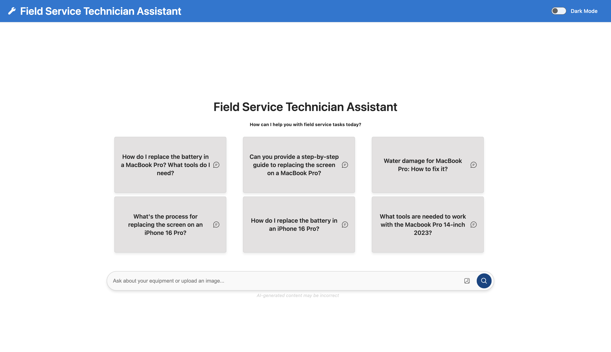
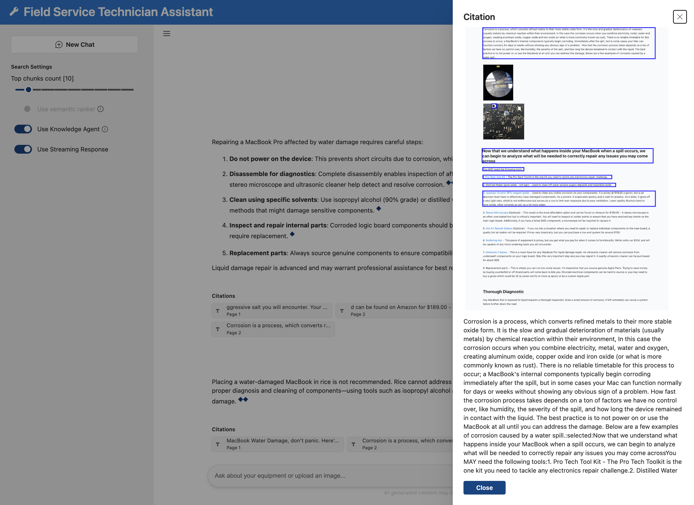

# Field Service Assistant: Multimodal RAG with Voice Interface



## Overview

The Field Service Assistant is a proof-of-concept application designed to revolutionize how field technicians access information and receive guidance in challenging industrial environments. By combining voice commands, image analysis, and multimodal retrieval capabilities, this system provides hands-free, contextual assistance when technicians need it most.

**Key Features:**

- 🗣️ **Voice Interface**: Hands-free speech-to-text input and text-to-speech responses using Azure OpenAI GPT-4o-Transcribe and GPT-4o-TTS
- 📸 **Image Analysis**: Submit photos of equipment for visual diagnostics and part identification
- 📚 **Multimodal RAG**: Retrieve relevant information from manuals, guides, and documentation based on both text and visual inputs
- 🧠 **Agentic Retrieval**: Smart, context-aware search that understands the technician's environment and needs
- ⚡ **Real-time Responses**: Optimized for low-latency, high-accuracy guidance in industrial settings

## Use Case

In fast-paced, noisy factory environments, field technicians often face complex issues that require digging through manuals, calling supervisors, or cross-referencing part images—all while trying to fix a machine. Switching between systems or screens wastes time and disrupts the repair process.

The Field Service Assistant solves this by allowing technicians to:

- Ask questions using natural voice commands while keeping hands free for repair work
- Submit photos of equipment or components for immediate identification and guidance
- Receive contextual instructions, part numbers, and repair procedures through voice feedback
- Access technical documentation instantly without manual searching

## System Architecture



The application is built on a modern architecture leveraging Azure's AI services:

1. **Frontend**: React-based UI with voice recording capabilities and image upload
2. **Backend**: FastAPI service with WebSocket streaming for real-time voice interaction
3. **Search Layer**: Azure AI Search with multimodal indexing of manuals and documentation
4. **AI Services**:
   - Azure OpenAI GPT-4o for conversational responses
   - GPT-4o-mini-transcribe for speech-to-text conversion
   - GPT-4o-mini-tts for text-to-speech output
   - Azure Document Intelligence for processing technical documentation

## Getting Started

### Prerequisites

- Azure account with subscription
- Azure AI Studio access
- Python 3.12+
- Node.js 18+
- Azure Developer CLI (azd)

### Quick Setup

1. **Clone the repository**

   ```bash
   git clone https://github.com/your-org/field-service-assistant.git
   cd field-service-assistant
   ```

2. **Provision Azure resources**

   ```bash
   az login --use-device-code
   azd auth login
   azd env new <YOUR_ENVIRONMENT_NAME>
   azd env set AZURE_PRINCIPAL_ID $(az ad signed-in-user show --query id -o tsv)
   azd up
   ```

3. **Start the application locally**

   ```bash
   src/start.sh
   ```

For detailed setup instructions, see the [Azure AI Search Multimodal RAG Demo documentation](docs/Multimodal%20RAG%20Sample%20README.md).

### Voice Integration

This project implements a complete voice interface using WebSockets for bidirectional audio streaming. See the [Voice Integration Plan](docs/voice-integration-plan.md) for implementation details.

## Bring Your Own Data

You can easily index your own technical documentation:

1. Place PDF documents in the `/data` folder
2. Run the indexing script:

   ```powershell
   scripts/prepdocs.ps1
   ```

## Azure Services Used

The application leverages the following Azure services:

1. **Azure AI Search** - For multimodal indexing and retrieval
2. **Azure AI Document Intelligence** - For processing technical documentation
3. **Azure OpenAI Service** - For LLM-powered responses and voice processing
4. **Azure Blob Storage** - For storing extracted images and data
5. **Azure App Service** - For hosting the application

## Workshop Materials

This repository contains the complete implementation demonstrated in the "Multimodal RAG for Field Technicians" workshop, including:

- Architecture reference for building multimodal RAG systems
- Complete voice interface implementation with Azure OpenAI
- Multimodal index creation using Azure AI Search
- Hands-free interaction patterns for industrial environments

## Demonstration

The system demonstrates the following end-to-end scenarios:

1. Submitting a voice question about equipment repair
2. Uploading an image of a component with a voice description
3. Receiving contextual repair instructions via voice
4. Retrieving specific technical documentation with visual citation

## Implementation Best Practices

This proof-of-concept follows several key principles for industrial field service applications:

- **Latency Optimization**: Streaming responses for immediate feedback
- **Error Resilience**: Graceful fallbacks for poor network conditions
- **Context Preservation**: Maintaining conversation history for continuous assistance
- **Multimodal Fusion**: Combining insights from both text and visual sources
- **Security**: Backend-driven approach for credential security

## Next Steps

Future enhancements could include:

1. Offline mode for limited connectivity environments
2. Custom voice commands for common repair procedures
3. Integration with AR/VR headsets for visual overlay guidance
4. Real-time performance metrics and diagnostics
5. Integration with equipment IoT sensors for predictive assistance

## License

[MIT License](LICENSE)

## Acknowledgments

This project builds upon the [Azure AI Search Multimodal RAG Demo](https://github.com/Azure-Samples/azure-ai-search-multimodal-sample) with additional voice capabilities.

### Key Azure AI Search Resources

- 📄 [Introducing Agentic Retrieval in Azure AI Search](https://techcommunity.microsoft.com/blog/azure-ai-services-blog/introducing-agentic-retrieval-in-azure-ai-search/4414677) - Learn about the next generation of intelligent search with agentic retrieval capabilities
- 📚 [Multimodal Search Overview](https://learn.microsoft.com/en-us/azure/search/multimodal-search-overview) - Official Microsoft documentation on multimodal search in Azure AI
- 🔍 [From Diagrams to Dialogue: New Multimodal Functionality in Azure AI Search](https://techcommunity.microsoft.com/blog/azure-ai-services-blog/from-diagrams-to-dialogue-introducing-new-multimodal-functionality-in-azure-ai-s/4413968) - How Azure AI unlocks insights from visual content
- 🖼️ [Get Started with Image Search in Azure Portal](https://learn.microsoft.com/en-us/azure/search/search-get-started-portal-image-search) - Tutorial for implementing image search capabilities

### Voice Technology References

- 🎤 [GPT-4o-mini-transcribe WebSocket Sample](https://gist.github.com/monuminu/a6ab13d03d82e1f1b6ea7a902f6e3803) - Real-time speech transcription implementation using Azure OpenAI's GPT-4o-mini-transcribe
- 🔊 [GPT-4o-mini-tts Async Streaming Sample](https://github.com/Azure-Samples/azure-openai-tts-demo/blob/main/async-streaming-tts-sample.py) - Text-to-speech implementation with Azure OpenAI's GPT-4o-mini-tts
